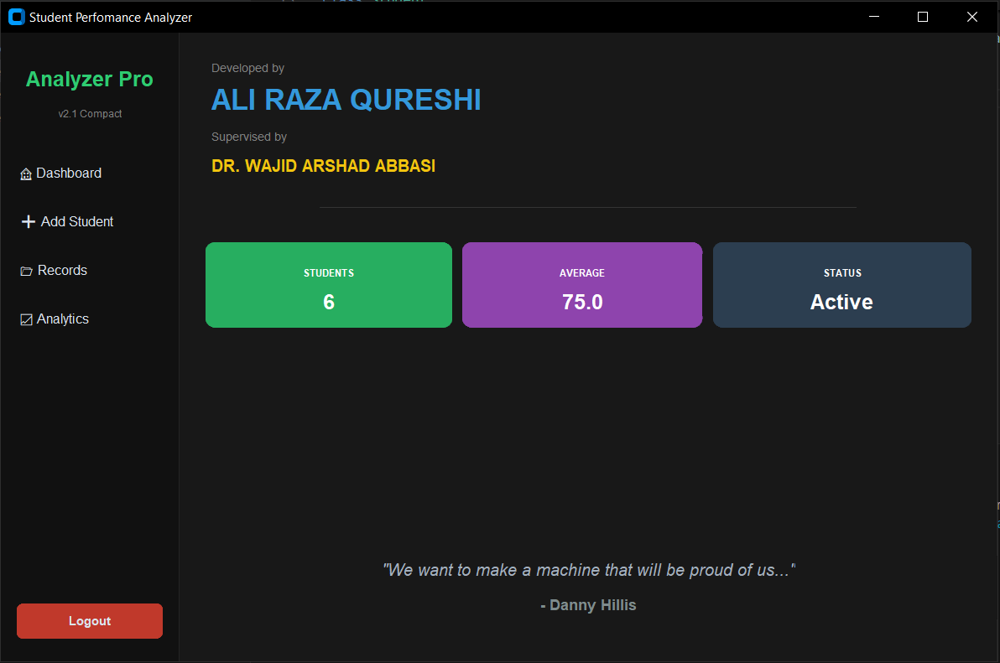
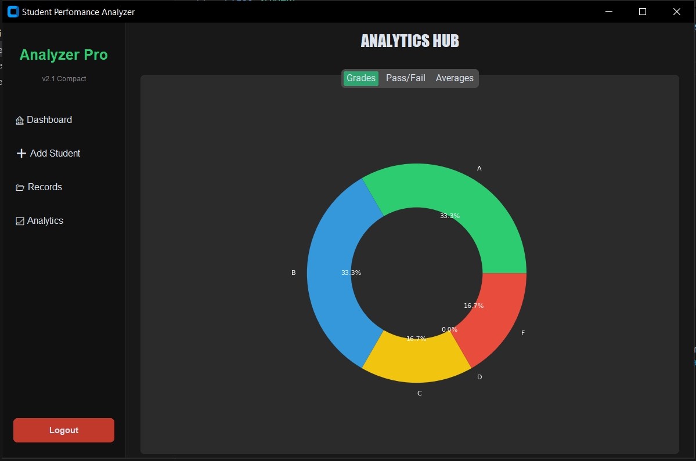
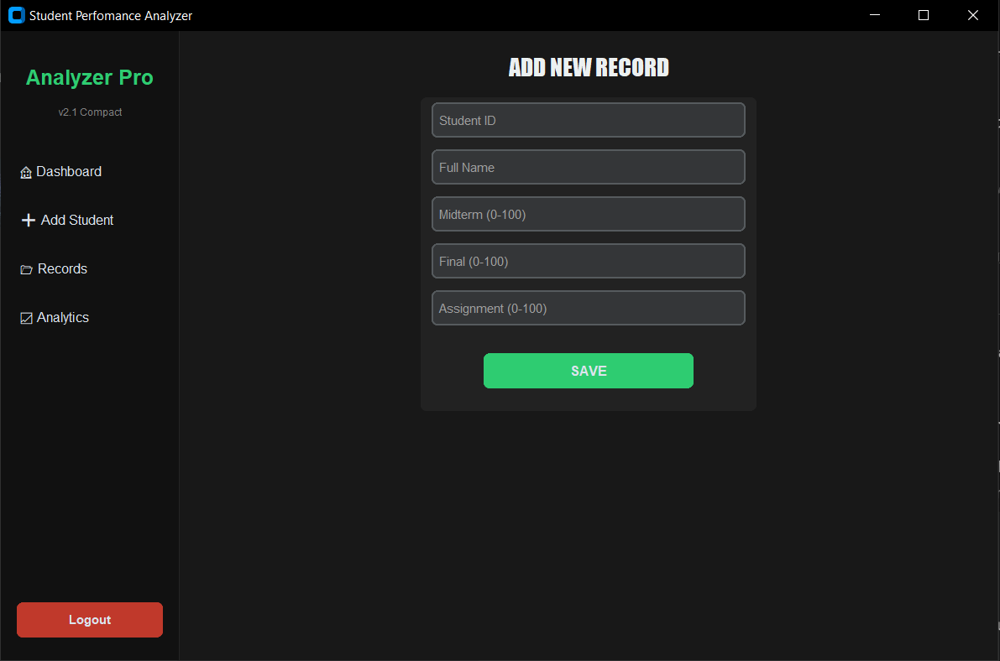
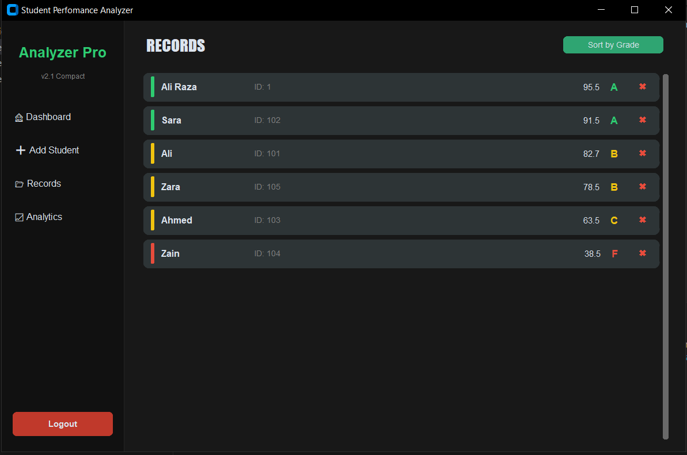

# 🎓 Student Performance Analyzer (Analyzer Pro v2.1)


## 📖 Overview

**Analyzer Pro v2.1** is a comprehensive desktop application designed to streamline the management of academic records. It allows educators to input student data, automatically calculate grades, and visualize performance metrics through an interactive dashboard.

Developed to bridge the gap between raw data entry and actionable insights, this tool provides a modern, dark-themed UI for efficient academic tracking.

> *"We want to make a machine that will be proud of us..."* – Danny Hillis

---

## ✨ Key Features

### 1. 🏠 Interactive Dashboard
- **Real-time Overview:** Instantly displays total student count and class average.
- **System Status:** Visual indicators for system activity.
- **Modern UI:** Built with a clean, dark-themed interface for reduced eye strain.

### 2. 📝 Record Management (CRUD)
- **Add New Records:** specific input fields for Midterm, Final, and Assignment marks (validated 0-100).
- **Auto-Grading Logic:** Automatically calculates the total percentage and assigns a Letter Grade (A, B, C, F) based on predefined thresholds.
- **Pass/Fail Detection:** Instant visual feedback on student status.

### 3. 📊 Analytics Hub
- **Visual Insights:** Replaces raw numbers with interactive charts.
- **Grade Distribution:** A Pie Chart breakdown of grades (A vs B vs C vs F).
- **Performance Ratio:** Visual representation of the Pass vs. Fail percentage for the entire batch.

### 4. 📂 Advanced Sorting & Listing
- **Dynamic List View:** Scrollable list of all registered students.
- **Sort Functionality:** "Sort by Grade" feature to quickly identify top performers or students needing attention.

---

## 📸 Screenshots

| **Dashboard** | **Analytics Hub** |
|:---:|:---:|
|  |  |
| *Real-time stats & quote* | *Grade distribution visualization* |

| **Add Record** | **Student List** |
|:---:|:---:|
|  |  |
| *Data entry with validation* | *Auto-calculated grades* |

---

## 🛠️ Tech Stack

* **Language:** `[Python]`
* **GUI Framework:** `[CustomTkinter / Tkinter / Windows Forms / WPF]`
* **Database:** `[Excel]`
* **Data Visualization:** `[Matplotlib / LiveCharts]`
* **IDE:** `[VS Code / Visual Studio]`

---

## 🚀 How to Run

1.  **Clone the repository:**
    ```bash
    git clone [https://github.com/your-username/student-performance-analyzer.git](https://github.com/your-username/student-performance-analyzer.git)
    ```
2.  **Install dependencies:**
    ```bash
    pip install -r requirements.txt
    # (Or instructions for your specific language)
    ```
3.  **Run the application:**
    ```bash
    python main.py
    # (Replace with your execution command)
    ```

---

## 👨‍💻 Author & Credits

**Developed by:** Ali Raza Qureshi  
**Supervised by:** Dr. Wajid Arshad Abbasi

This project was developed as part of `Programming for AI | Semester Project` to demonstrate proficiency in desktop application development and data handling.

---

## 🤝 Contributing

Contributions, issues, and feature requests are welcome! Feel free to check the [issues page](issues/).

1. Fork the Project
2. Create your Feature Branch (`git checkout -b feature/AmazingFeature`)
3. Commit your Changes (`git commit -m 'Add some AmazingFeature'`)
4. Push to the Branch (`git push origin feature/AmazingFeature`)
5. Open a Pull Request

---

## 📄 License

Distributed under the MIT License. See `LICENSE` for more information.
